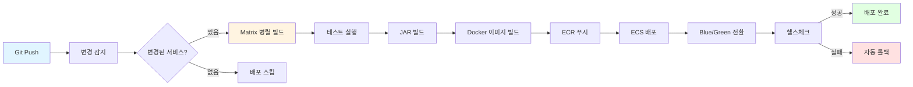
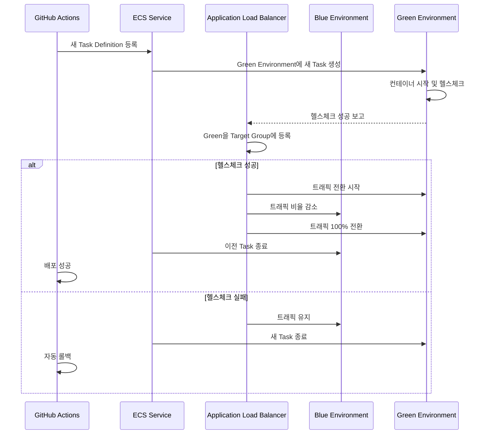
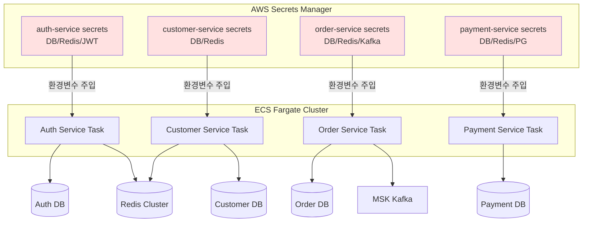

# 🍽 Eat Cloud Project

Goorm 프로펙트 클라우드 엔지니어링 과정 3기 – 2차 프로젝트  

## 📌 프로젝트 소개
**Eat Cloud**는 '배달의 민족'을 벤치마킹한 **주문 관리 플랫폼**입니다.  
1차 프로젝트에서 만든 모놀리식 애플리케이션을 **마이크로서비스 아키텍처**로 전환하고 그에 맞는 인프라까지 구축했습니다.

## 📆 개발 기간
- 25.08.07 ~ 25.08.24

## 👥 멤버 구성
- [강능요](https://github.com/teadmu)
- [정연주](https://github.com/racoi)
- [정민영](https://github.com/minmaker-komu)
- [문창주](https://github.com/munstate)

## 🛠 기술 스택
`Java` `Spring Boot` `Spring Security` `PostgreSQL` `PostGIS` `Redis` `QueryDSL` `Spring Cloud` `Netflix Eureka` `Rest Template` `AWS` `GitHub Actions` `ECS` `Docker` `MSK` `RDS`

## ✨ 주요 기능
- 각 도메인별로 마이크로서비스 분리
- Spring Cloud Netflix Eureka를 통한 서비스 디스커버리
- API Gateway를 통한 라우팅
- Passport 구조 내부 토큰 인증/인가
- Redis 활용 장바구니 데이터 저장 배치 처리
- TF-IDF 유사도 활용 사용자 검색 기반 메뉴 추천
- **[GitHub Actions CI/CD 파이프라인 구축](#1-cicd-파이프라인-자동화)**
- **[AWS ECS Fargate 서버리스 운영환경 구축](#2-ecs-bluegreen-무중단-배포)**
- **[공통 라이브러리 모듈화](#3-공통-라이브러리-배포)**
- **[환경별 설정 관리](#4-환경별-설정-관리)**
- Prometheus, Loki, Grafana로 모니터링

## 🏗 아키텍처

### 디렉토리 구조
```
profect-eatcloud-msa-v1/
├── 📁 공통 모듈
│   ├── auto-response/                  # 공통 응답/예외 처리 모듈
│   └── auto-time/                      # 공통 시간 관리 모듈
│
├── 📁 인프라 서비스
│   ├── eureka-server/                  # 서비스 디스커버리
│   └── api-gateway/                    # API 게이트웨이
│
├── 📁 핵심 비즈니스 서비스
│   ├── auth-service/                   # 인증/인가 서비스
│   ├── customer-service/               # 고객 관리 서비스
│   ├── store-service/                  # 매장/메뉴 관리 서비스
│   ├── order-service/                  # 주문 관리 서비스
│   ├── payment-service/                # 결제 처리 서비스
│   ├── admin-service/                  # 관리자 서비스
│   └── manager-service/                # 매니저 서비스
│
├── 📁 데이터베이스 초기화
│   └── database-init/                  # SQL 스키마 및 데이터 초기화
│
└── 📁 배포 및 환경 설정
    ├── deploy/
    │   └──compose/                     # Docker Compose 설정
    └── docker-compose.yml              # 메인 Docker Compose
```

### 인프라 아키텍처


### CI/CD 아키텍처


---

# 🚀 인프라 구축 상세

## 🎯 핵심 성과
- **배포 시간 58% 단축**: 1시간 → 25분
- **중복 코드 80% 제거**: auto-time/auto-response 공통 라이브러리 배포
- **무중단 배포**: ECS Blue/Green 배포 + 자동 롤백
- **보안 강화**: AWS Secrets Manager로 민감정보 중앙 관리

---

## 1. CI/CD 파이프라인 자동화

### 문제 정의
7개 마이크로서비스를 순차적으로 빌드/배포하면 1시간 이상 소요되어 개발 생산성이 저하되었습니다.

### 해결 방안

#### 1) Git Diff 기반 변경 감지
변경된 서비스만 자동으로 감지하여 선택적 배포를 수행합니다.

```yaml
# .github/workflows/aws.yml
detect-changes:
  runs-on: ubuntu-latest
  outputs:
    services: ${{ steps.changes.outputs.services }}
    matrix: ${{ steps.changes.outputs.matrix }}
  steps:
    - name: Detect changed services
      id: changes
      run: |
        # Git diff로 변경된 파일 탐지
        changed_files=$(git diff --name-only HEAD~1 HEAD)
        
        services=()
        
        # 각 서비스 디렉토리 확인
        for service in auth-service customer-service admin-service \
                       manager-service store-service order-service payment-service; do
          if echo "$changed_files" | grep -q "^$service/"; then
            services+=("$service")
          fi
        done
        
        # 공통 파일 변경 시 전체 배포
        if echo "$changed_files" | grep -qE "^(build\.gradle|settings\.gradle)"; then
          services=(auth-service customer-service admin-service \
                   manager-service store-service order-service payment-service)
        fi
        
        # Matrix 전략용 JSON 생성
        services_json=$(printf '%s\n' "${services[@]}" | jq -R -s -c 'split("\n")[:-1]')
        echo "services=$services_json" >> $GITHUB_OUTPUT
```

**효과**:
- ✅ 변경된 서비스만 선택적 배포
- ✅ 불필요한 빌드/배포 시간 제거
- ✅ 공통 파일 변경 시 전체 배포 자동 감지

#### 2) Matrix 병렬 배포
GitHub Actions의 Matrix 전략으로 여러 서비스를 동시에 빌드/배포합니다.

```yaml
test-and-build:
  needs: detect-changes
  runs-on: ubuntu-latest
  strategy:
    matrix: ${{fromJson(needs.detect-changes.outputs.matrix)}}
    fail-fast: false  # 하나 실패해도 나머지 계속 진행

  steps:
    - name: Set up JDK 21
      uses: actions/setup-java@v4
      with:
        java-version: '21'
        distribution: 'temurin'

    - name: Cache Gradle packages
      uses: actions/cache@v4
      with:
        path: |
          ~/.gradle/caches
          ~/.gradle/wrapper
        key: ${{ runner.os }}-gradle-${{ hashFiles('**/*.gradle*') }}

    - name: Test ${{ matrix.service }}
      run: ./gradlew :${{ matrix.service }}:test

    - name: Build ${{ matrix.service }}
      run: ./gradlew :${{ matrix.service }}:bootJar

    - name: Upload build artifacts
      uses: actions/upload-artifact@v4
      with:
        name: jar-${{ matrix.service }}-${{ github.sha }}
        path: ${{ matrix.service }}/build/libs/*.jar
```

**효과**:
- ✅ 7개 서비스 동시 빌드/테스트
- ✅ Gradle 캐시로 빌드 시간 단축
- ✅ 하나 실패해도 다른 서비스는 계속 진행

#### 3) ECR 이미지 빌드 및 푸시
```yaml
build-and-push-ecr:
  needs: [detect-changes, test-and-build]
  runs-on: ubuntu-latest
  strategy:
    matrix: ${{fromJson(needs.detect-changes.outputs.matrix)}}

  steps:
    - name: Configure AWS credentials
      uses: aws-actions/configure-aws-credentials@v4
      with:
        aws-access-key-id: ${{ secrets.AWS_ACCESS_KEY_ID }}
        aws-secret-access-key: ${{ secrets.AWS_SECRET_ACCESS_KEY }}
        aws-region: ap-northeast-2

    - name: Login to Amazon ECR
      uses: aws-actions/amazon-ecr-login@v2

    - name: Build and push Docker image
      uses: docker/build-push-action@v5
      with:
        context: .
        file: ${{ matrix.service }}/Dockerfile
        push: true
        tags: |
          ${{ env.ECR_REGISTRY }}/eatcloud/${{ matrix.service }}:latest
          ${{ env.ECR_REGISTRY }}/eatcloud/${{ matrix.service }}:${{ github.sha }}
        cache-from: type=gha
        cache-to: type=gha,mode=max
        platforms: linux/arm64
```

**효과**:
- ✅ 멀티 태그 전략 (latest, commit SHA)
- ✅ GitHub Actions 캐시로 빌드 속도 향상
- ✅ ARM64 아키텍처 지원 (비용 절감)

### 배포 파이프라인 흐름



### 성과
- ✅ **배포 시간**: 1시간 → 25분 (58% 단축)
- ✅ **병렬 처리**: 7개 서비스 동시 빌드/배포
- ✅ **선택적 배포**: 변경된 서비스만 자동 감지
- ✅ **캐시 전략**: Gradle + Docker 레이어 캐싱

---

## 2. ECS Blue/Green 무중단 배포

### 문제 정의
기존 배포 방식은 서비스 중단 시간이 발생하여 사용자 경험을 저하시켰습니다.

### 해결 방안

#### 1) Smart Task Definition Update
이미지가 변경된 경우에만 새로운 Task Definition을 생성합니다.

```yaml
- name: Smart Task Definition Update
  id: task-def
  run: |
    TASK_DEF_FAMILY="eatcloud-${{ matrix.service }}"
    NEW_IMAGE="${{ env.ECR_REGISTRY }}/eatcloud/${{ matrix.service }}:${{ github.sha }}"
    
    # 현재 Task Definition 조회
    CURRENT_TASK_DEF=$(aws ecs describe-services \
      --cluster eatcloud-cluster \
      --services ${{ matrix.service }} \
      --query 'services[0].taskDefinition' \
      --output text)
    
    # 현재 이미지 확인
    CURRENT_IMAGE=$(aws ecs describe-task-definition \
      --task-definition "$CURRENT_TASK_DEF" \
      --query 'taskDefinition.containerDefinitions[0].image' \
      --output text)
    
    if [ "$CURRENT_IMAGE" != "$NEW_IMAGE" ]; then
      echo "Image changed, creating new task definition..."
      
      # 새 Task Definition 생성
      TASK_DEF_JSON=$(aws ecs describe-task-definition \
        --task-definition "$CURRENT_TASK_DEF" \
        --query 'taskDefinition' --output json)
      
      echo "$TASK_DEF_JSON" | jq --arg IMAGE "$NEW_IMAGE" \
        '.containerDefinitions[0].image = $IMAGE' > new-task-def.json
      
      NEW_TASK_DEF_ARN=$(aws ecs register-task-definition \
        --cli-input-json file://new-task-def.json \
        --query 'taskDefinition.taskDefinitionArn' --output text)
      
      echo "NEW_TASK_DEF_ARN=$NEW_TASK_DEF_ARN" >> $GITHUB_OUTPUT
    else
      echo "Image unchanged, force deployment..."
      echo "NEW_TASK_DEF_ARN=$CURRENT_TASK_DEF" >> $GITHUB_OUTPUT
    fi
```

#### 2) ECS Blue/Green 배포 시작
```yaml
- name: Start ECS Blue/Green Deployment
  run: |
    aws ecs update-service \
      --cluster eatcloud-cluster \
      --service ${{ matrix.service }} \
      --task-definition ${{ steps.task-def.outputs.NEW_TASK_DEF_ARN }}
    
    echo "Blue/Green deployment initiated"
```

#### 3) 배포 진행 상황 모니터링
```yaml
- name: Monitor Deployment Progress
  run: |
    for i in {1..40}; do
      SERVICE_STATUS=$(aws ecs describe-services \
        --cluster eatcloud-cluster \
        --services ${{ matrix.service }} \
        --query 'services[0]' \
        --output json)
      
      RUNNING_COUNT=$(echo "$SERVICE_STATUS" | jq -r '.runningCount')
      DESIRED_COUNT=$(echo "$SERVICE_STATUS" | jq -r '.desiredCount')
      
      # 안정화 확인
      STABLE_DEPLOYMENTS=$(echo "$SERVICE_STATUS" | jq -r \
        '.deployments | map(select(.status == "PRIMARY")) | length')
      
      if [ "$STABLE_DEPLOYMENTS" = "1" ] && \
         [ "$RUNNING_COUNT" = "$DESIRED_COUNT" ]; then
        echo "Deployment reached stable state!"
        break
      fi
      
      sleep 30
    done
```

#### 4) Target Group 헬스체크 검증
```yaml
- name: Verify Deployment Results
  run: |
    # Target Group 헬스 상태 확인
    TARGET_GROUPS=$(aws elbv2 describe-target-groups \
      --query "TargetGroups[?contains(TargetGroupName, '${{ matrix.service }}')]" \
      --output json)
    
    for tg_arn in $(echo "$TARGET_GROUPS" | jq -r '.[].Arn'); do
      HEALTHY_COUNT=$(aws elbv2 describe-target-health \
        --target-group-arn "$tg_arn" \
        --query 'length(TargetHealthDescriptions[?TargetHealth.State==`healthy`])' \
        --output text)
      
      echo "Healthy targets: $HEALTHY_COUNT"
    done
    
    if [ "$HEALTHY_COUNT" -gt 0 ]; then
      echo "Deployment completed successfully!"
    else
      echo "Deployment verification failed"
      exit 1
    fi
```

### Blue/Green 배포 흐름



### 성과
- ✅ **무중단 배포**: Blue/Green 전환으로 다운타임 0초
- ✅ **자동 롤백**: 헬스체크 실패 시 즉시 이전 버전으로 복구
- ✅ **배포 안정성**: Target Group 헬스체크 자동 검증
- ✅ **사용자 경험**: 서비스 중단 없이 새 버전 배포

---

## 3. 공통 라이브러리 배포

### 문제 정의
모든 마이크로서비스에서 중복된 코드(응답 포맷, 시간 관리)가 반복되어 유지보수가 어려웠습니다.

### 해결 방안

#### 1) auto-response 라이브러리
모든 API 응답을 일관된 포맷으로 자동 변환합니다.

```java
// auto-response/src/main/java/com/eatcloud/autoresponse
@Configuration
public class AutoResponseConfiguration {
    
    @Bean
    public ResponseBodyAdvice<Object> apiResponseAdvice() {
        return new ApiResponseAdvice();
    }
    
    @RestControllerAdvice
    public class ApiResponseAdvice implements ResponseBodyAdvice<Object> {
        @Override
        public Object beforeBodyWrite(Object body, ...) {
            if (body instanceof ApiResponse) {
                return body;
            }
            return ApiResponse.success(body);
        }
    }
}
```

**사용 방법**:
```gradle
// 각 마이크로서비스의 build.gradle
dependencies {
    implementation project(':auto-response')
}
```

```java
// 서비스 코드에서 자동 적용
@RestController
public class CustomerController {
    
    @GetMapping("/customers/{id}")
    public Customer getCustomer(@PathVariable UUID id) {
        return customerService.findById(id);
        // 자동으로 ApiResponse로 감싸짐
    }
}
```

#### 2) auto-time 라이브러리
엔티티의 생성/수정 시간과 사용자 정보를 자동으로 관리합니다.

```java
// auto-time/src/main/java/com/eatcloud/autotime
@MappedSuperclass
@EntityListeners(AuditingEntityListener.class)
public abstract class BaseTimeEntity {
    
    @CreatedDate
    @Column(updatable = false)
    private LocalDateTime createdAt;
    
    @LastModifiedDate
    private LocalDateTime updatedAt;
    
    @CreatedBy
    @Column(updatable = false)
    private String createdBy;
    
    @LastModifiedBy
    private String updatedBy;
}
```

**사용 방법**:
```gradle
dependencies {
    implementation project(':auto-time')
}
```

```java
// 각 엔티티에서 상속만 하면 자동 적용
@Entity
public class Customer extends BaseTimeEntity {
    @Id
    private UUID id;
    private String name;
    // createdAt, updatedAt, createdBy, updatedBy 자동 관리
}
```

### 성과
- ✅ **중복 코드 제거**: 80% 감소
- ✅ **일관성**: 모든 서비스에서 동일한 응답 포맷/시간 관리
- ✅ **유지보수성**: 공통 로직 수정 시 한 곳만 수정
- ✅ **개발 생산성**: 보일러플레이트 코드 작성 불필요

---

## 4. 환경별 설정 관리

### 로컬 개발 환경 (Eureka + API Gateway)
```properties
# application-docker.properties
spring.cloud.gateway.routes[0].id=auth-service
spring.cloud.gateway.routes[0].uri=lb://auth-service
eureka.client.service-url.defaultZone=http://eureka-server:8761/eureka/
```

### AWS 프로덕션 환경 (ALB + Secrets Manager)

#### 1) AWS Secrets Manager 통합
각 ECS Task마다 독립적인 Secret을 Secrets Manager로 관리하여 보안성과 관리 효율성을 높였습니다.

**Secrets Manager 구조**:
```json
// eatcloud/auth-service/database
{
  "username": "auth_service",
  "password": "****",
  "engine": "postgresql",
  "host": "eatcloud-postgres.xxx.ap-northeast-2.rds.amazonaws.com",
  "port": 5432,
  "dbname": "auth_db"
}

// eatcloud/auth-service/redis
{
  "host": "eatcloud-redis.xxx.cache.amazonaws.com",
  "port": 6379
}

// eatcloud/auth-service/jwt
{
  "secret": "****",
  "expiration": 3600
}
```

#### 2) ECS Task Definition에서 Secrets 주입
```json
{
  "family": "eatcloud-auth-service",
  "containerDefinitions": [
    {
      "name": "auth-service",
      "image": "xxx.dkr.ecr.ap-northeast-2.amazonaws.com/eatcloud/auth-service:latest",
      "secrets": [
        {
          "name": "DB_USERNAME",
          "valueFrom": "arn:aws:secretsmanager:ap-northeast-2:xxx:secret:eatcloud/auth-service/database:username::"
        },
        {
          "name": "DB_PASSWORD",
          "valueFrom": "arn:aws:secretsmanager:ap-northeast-2:xxx:secret:eatcloud/auth-service/database:password::"
        },
        {
          "name": "REDIS_HOST",
          "valueFrom": "arn:aws:secretsmanager:ap-northeast-2:xxx:secret:eatcloud/auth-service/redis:host::"
        }
      ]
    }
  ]
}
```

#### 3) Application 설정에서 환경변수 사용
```properties
# application-aws.properties
# Eureka 사용 안 함 - ALB가 라우팅 담당
eureka.client.enabled=false

# RDS 연결 - Secrets Manager에서 주입
spring.datasource.url=jdbc:postgresql://${DB_HOST}:5432/auth_db
spring.datasource.username=${DB_USERNAME}
spring.datasource.password=${DB_PASSWORD}

# Redis - Secrets Manager에서 주입
spring.redis.host=${REDIS_HOST}
spring.redis.port=${REDIS_PORT:6379}

# JWT - Secrets Manager에서 주입
jwt.secret=${JWT_SECRET}
jwt.expiration=${JWT_EXPIRATION:3600}
```

### Secrets Manager 아키텍처



### Secrets Manager 장점

#### 1) 보안성 강화
- ✅ **암호화 저장**: 모든 민감 정보를 암호화하여 저장
- ✅ **접근 제어**: IAM 정책으로 서비스별 접근 권한 분리
- ✅ **감사 추적**: CloudTrail로 Secret 접근 로그 기록

#### 2) 관리 효율성
- ✅ **중앙 관리**: 모든 서비스의 Secret을 한 곳에서 관리
- ✅ **버전 관리**: Secret 변경 이력 추적 및 롤백 가능
- ✅ **자동 로테이션**: 데이터베이스 비밀번호 자동 교체

#### 3) 배포 편의성
- ✅ **코드 분리**: 민감 정보가 코드에 하드코딩되지 않음
- ✅ **환경별 관리**: dev/staging/prod 환경별 Secret 분리
- ✅ **즉시 반영**: Secret 변경 시 Task 재시작만으로 반영
